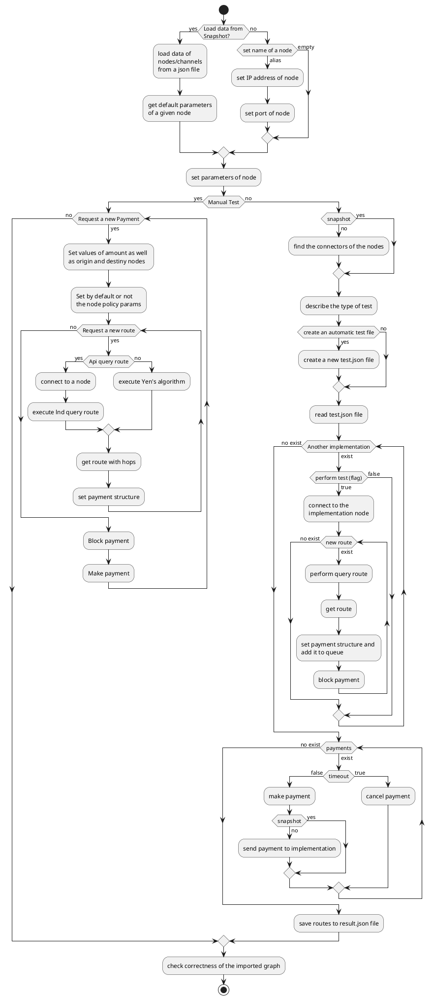

# ln-payment
ln-payment is a simulator that works over the lightning network with the aim to provide a global understanding about its functionality as a network and possible improvement to its technology.
The simulator works with LN implementations to validate the route handling.
Once the routes are found, we proceeded to implement the functions of blocking and making payment as final step in the simulation. However, we include a timeout control to cancel the payment in case of an exceeding the time to send a payment


Additional functionality such as describe a graph, query routes, get info, send payment were used from each implementation.
Finally, the simulator takes on account two considerations: one is that the simulations can be performed one at a time (manual 
test), and the other is that simulator can run a set of test (automatic test) from a test file:

Previous to execute the simulator, the reader must fulfill the following [Prerequisites](PREREQUISITES.md) to be able to execute the software properly.

* The section [Libraries](./PREREQUISITES.md#libraries) specifies the several libraries that must be installed beforehand the execution of the simulator
* The section [Proto buffer modules](./PREREQUISITES.md#proto-buffer-modules) describes the wrapper modules required to connect to an LND modules. In case that any module shows up any error, it is advisable to recompile the proto buffer files specified on the **note** of this section
* The section [Additional modules](./PREREQUISITES.md#additional-modules) makes reference to all the modules involved in the simulator and describe its functionality
* The section [Support files](./PREREQUISITES.md#support-files) explains the essential parameters for the proper execution of the simulator. The user must put attention to specific parameters, such us:
    * polar_path on `parameters.json` (partial path to a node on the POLAR app given by /home/**USER**/.polar/networks/**INDEX_POLAR_NETWORK**/volumes/. The highlighted sections on the previous path must be modified according to the unix environment on which the user is testing the simulator, for instance, /home/deic/.polar/networks/1/volumes/)
    * routes on `test.json` (array of routes to perform a query route and their corresponding block and make payment)
    
In addition, to the prerequisites, the user must deploy a network in the POLAR app. The network is necessary since the simulator can connect to the LN implementations (lnd, eclair and c-lightning), to compare the results of their query routes against the implementation of Yen's algorithm. As an example, in the root of the project, we can find the file LN_polar.zip that contains an LN network in which the three implementations are included.

To sum up, the reader must perform the following steps previously to execute the simulator:

1. Download the [ln-payment](https://github.com/StvanLeo/ln-payment.git) GitHub repository
2. Create a python virtual environment on the same folder as the one that contains the GitHub repository
3. Install the required libraries with their corresponding versions
4. Set the values of the configuration parameters, especially **polar_path** and **port** (on: connector/lnd) on `parameters.json`
5. Set the values of the test parameters, especially **routes** and **port** (in lnd/node) on `test.json`
6. Deploy an LN network on Polar
7. Set the LN network with the different scenarios (full connectivity among nodes, partial disconnection of nodes and partial disconnection of channels)
8. Recreate, if necessary, the snapshot file (lnd_describegraph_regtest.json) through the following commands (that connect to a node on Polar) on a terminal:
```sh
  deic@deic:~$ sudo docker exec -it polar-n1-alice /bin/bash
  root@alice:/# su lnd
  $ lncli --network=regtest describegraph
```
* n1 on polar-n1-alice correspond to the index of the Polar network, for example, if it is the fifth network on Polar, the command would include polar-n5-alice

## Test

The following sequence diagram shows the flow of the simulator, but, for a better visualization of the simulation, please refer to [Test](TEST.md) 

>**CAUTION:**
>The following message indicates that the simulator is trying to connect to an LND node to determine its grpc port, it is only a warning message, not an error message  
 [E0204 20:56:38.633000000  1816 src/core/tsi/ssl_transport_security.cc:1458] Handshake failed with fatal error SSL_ERROR_SSL: error:1000007d:SSL routines:OPENSSL_internal:CERTIFICATE_VERIFY_FAILED.

<!------>


